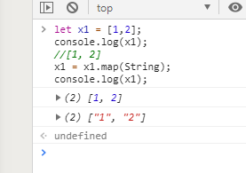

## 数组内参数类型转换

1. 将 string 数组转换为 number 数组

   ```
   let x1 = ['1','2'];
   console.log(x1);
   //["1", "2"]
   x1 = x1.map(Number);
   ```

2. 将 number 数组转换为 string 数组

   ```
   let x1 = [1,2];
   console.log(x1);
   //[1, 2]
   x1 = x1.map(String);
   console.log(x1);
   ```

   输出展示：




> 原理解析：   

1. map函数的第一个参数是一个回调函数；回调函数本身有三个参数：   

***currentValue***（当前元素）、***index***（当前元素的下标）、***array***（被调用的数组）   

```
// 测试发现：
var arr = ["1", "2", "3"];
arr.map(function () {
    console.log(arguments);
});
js:1 Arguments(3) ["1", 0, Array(3), callee: ƒ, Symbol(Symbol.iterator): ƒ]
js:1 Arguments(3) ["2", 1, Array(3), callee: ƒ, Symbol(Symbol.iterator): ƒ]
js:1 Arguments(3) ["3", 2, Array(3), callee: ƒ, Symbol(Symbol.iterator): ƒ]

```

2. 由此可见，当我们传入Number的时候，事实上是相当于：   

```
// 相当于：
arr.map(function () {
    Number(arguments.toString());
});

// tips：在对象中，toString()会输出对象的 value 值，所以：
在 Arguments(3) ["1", 0, Array(3), callee: ƒ, Symbol(Symbol.iterator): ƒ] 数组中,会被转换成value值中的 “1”.

["1", 0, Array(3), callee: ƒ, Symbol(Symbol.iterator): ƒ].toString() => "1"

```

3. 所以传入 Number 时等同于：
```
var arr = ["1", "2", "3"];
	arr.map(Number);
=>
arr.map(function (currentValue, index, array) {
	// 当 currentValue 为 “1” 时：
    return Number(arguments.toString()) => Number("1") => 1;
    
    // 当 currentValue 为 “2” 时：
    return Number(arguments.toString()) => Number("2") => 2;
    
    // 当 currentValue 为 “3” 时：
    return Number(arguments.toString()) => Number("3") => 3;
});

// 所以，我们可以得到这样一个结果：
["1", "2", "3"].map(Number) => [1, 2, 3]
```


4. 传入 String 时，同理